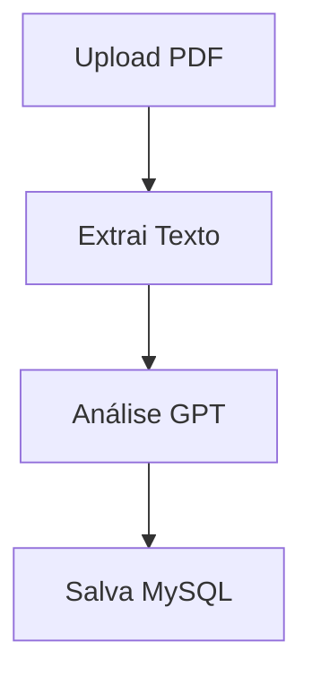
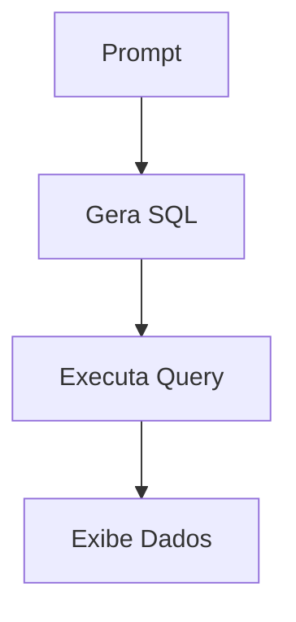

# CV Analyzer Pro

## 🎯 Sobre
CV Analyzer Pro é uma aplicação web moderna para análise automática de currículos usando IA. Processa PDFs de currículos, extrai informações relevantes e fornece insights através de uma interface intuitiva.

## ✨ Funcionalidades

### Processamento de Currículos
- Upload múltiplo de PDFs
- Extração automática de texto
- Análise por IA (GPT-4)
- Armazenamento estruturado em MySQL

### Análise de Dados
- Visualização tabular dos candidatos
- Filtros dinâmicos
- Exportação de dados
- Consultas personalizadas em linguagem natural

### Insights de IA
- Extração automática de:
  - Dados pessoais
  - Formação acadêmica
  - Experiência profissional
  - Habilidades técnicas
  - Contatos e redes sociais
- Observações e insights relevantes

## 🔧 Tecnologias

- **Frontend**: Streamlit
- **Backend**: Python
- **Database**: MySQL
- **AI**: OpenAI GPT-4
- **PDF Processing**: PyPDF2

## 📦 Estrutura do Projeto e Código

### 📁 Organização
```
cv_analyzer/
├── .streamlit/          # Configurações Streamlit
│   └── secrets.toml     # Credenciais
├── src/
│   ├── config/          # Configurações globais
│   ├── database/        # Conexão MySQL
│   ├── services/        # Lógica de negócios
│   ├── utils/           # Funções auxiliares
│   └── ui/              # Interface Streamlit
├── requirements.txt     # Dependências
└── app.py              # Entrada da aplicação
```

### 🔍 Detalhamento dos Componentes

#### Config (`src/config/`)
```python
# settings.py
- OPENAI_KEY: Chave API OpenAI
- DB_CONFIG: Credenciais MySQL
- SQL_SCHEMA: Estrutura da tabela candidatos
```

#### Database (`src/database/`)
```python
# connection.py
class DatabaseConnection:
    get_connection(): 
        # Estabelece conexão MySQL
        # Cria tabelas se necessário
    
    close_connection():
        # Fecha conexão e cursor
```

#### Services (`src/services/`)
```python
# pdf_service.py
class PDFService:
    extrair_texto():
        # Extração de texto de PDFs

# gpt_service.py
class GPTService:
    analisar_curriculo():
        # Análise GPT do currículo
        # Retorna dados estruturados
    
    gerar_query_sql():
        # Converte prompt para SQL

# data_service.py
class DataService:
    salvar_candidato():
        # Persistência MySQL
    
    buscar_candidatos():
        # Consultas ao banco
```

#### UI (`src/ui/components/`)
```python
# upload.py, viewer.py, query.py
- Interface upload PDFs
- Visualização de dados
- Consultas em linguagem natural
```

## 🚀 Instalação

1. Clone o repositório:
```bash
git clone https://github.com/seu-usuario/cv-analyzer-pro.git
cd cv-analyzer-pro
```

2. Configure o ambiente virtual:
```bash
python -m venv venv
source venv/bin/activate  # Linux/Mac
venv\Scripts\activate     # Windows
```

3. Instale as dependências:
```bash
pip install -r requirements.txt
```

4. Configure `.streamlit/secrets.toml`:
```toml
openai_key = "sua_chave_openai"
mysql_host = "localhost"
mysql_user = "seu_usuario"
mysql_password = "sua_senha"
mysql_database = "cv_database"
```

## 💾 Banco de Dados

### Estrutura
```sql
CREATE TABLE candidatos (
    id INT AUTO_INCREMENT PRIMARY KEY,
    nome VARCHAR(255),
    email VARCHAR(255),
    genero VARCHAR(50),
    idade INT,
    instituto_formacao VARCHAR(255),
    curso VARCHAR(255),
    periodo VARCHAR(50),
    tempo_experiencia FLOAT,
    area_atuacao VARCHAR(255),
    ultima_experiencia TEXT,
    todas_experiencias TEXT,
    habilidades TEXT,
    linkedin VARCHAR(255),
    github VARCHAR(255),
    telefone VARCHAR(50),
    data_criacao DATETIME,
    pdf_conteudo LONGTEXT,
    observacoes_ia JSON,
    campos_dinamicos JSON
);
```

## 🔄 Fluxos de Dados

### Upload e Análise


### Consultas


## 🤖 Integração GPT-4

### Análise de Currículos
```python
response = openai.chat.completions.create(
    model="gpt-4",
    messages=[
        {"role": "system", "content": "Extraia informações estruturadas do currículo."},
        {"role": "user", "content": texto_curriculo}
    ]
)
```

### Geração de Queries
```python
response = openai.chat.completions.create(
    model="gpt-4",
    messages=[
        {"role": "system", "content": "Gere SQL baseado no schema."},
        {"role": "user", "content": f"{schema}\n{prompt}"}
    ]
)
```

## 📊 Exemplos de Uso

### Consultas Comuns
```sql
# Candidatos por área
SELECT area_atuacao, COUNT(*) as total 
FROM candidatos 
GROUP BY area_atuacao;

# Habilidades mais comuns
SELECT JSON_EXTRACT(habilidades, '$[*]') as skills 
FROM candidatos;
```

### Código Python
```python
# Extrair texto
texto = PDFService.extrair_texto(arquivo_pdf)

# Analisar com GPT
dados = GPTService.analisar_curriculo(texto)

# Salvar dados
DataService.salvar_candidato(dados, texto_pdf)
```

## 🛠️ Desenvolvimento

### Contribuição
1. Fork o projeto
2. Crie uma branch (`git checkout -b feature/nova-feature`)
3. Commit suas mudanças (`git commit -m 'Adiciona nova feature'`)
4. Push para a branch (`git push origin feature/nova-feature`)
5. Abra um Pull Request

## 🔐 Segurança
- Dados sensíveis em `secrets.toml`
- Validação de inputs
- Sanitização de SQL
- Logs de acesso

## 📄 Licença
MIT License. Ver arquivo `LICENSE` para mais detalhes.

## 🤝 Contribuidores
- Seu Nome (@seu-usuario)
- Outros contribuidores

## 📧 Contato
- Email: pedro.guimaraes02@hotmail.com
- LinkedIn:https://www.linkedin.com/in/pedro-henrique-santos-guimar%C3%A3es-b06555121/
- GitHub: https://github.com/PedroHSGuimaraes
